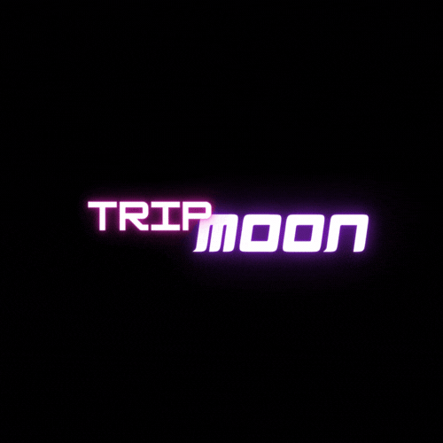

  

# TripMoon
Juego de Realidad Virtual y Realidad Aumentada en Unity

# Pasos para ejecutar el proyecto con Vuforia

## Paso 1. Añadir Vuforia cada uno en su pc
En la carpeta trip-moon -> Packages. Tenemos que añadir el tgz que está en drive con el nombre 
com.ptc.vuforia.engine-10.10.2 , este archivo esta puesto en el gitignore para que no se suba a git.

## Paso 2. Importar Vuforia
Assets -> Reimport All 

## Paso 3. 

